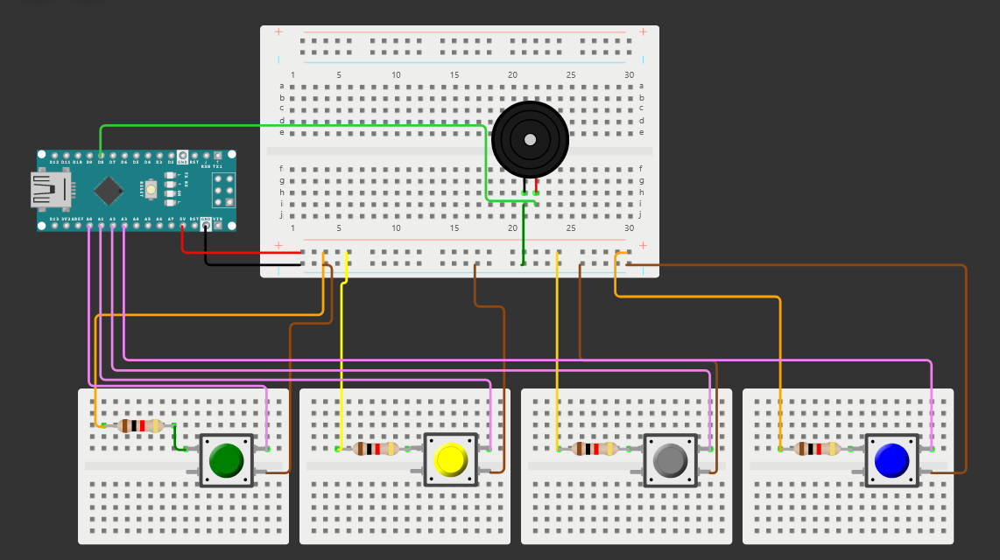
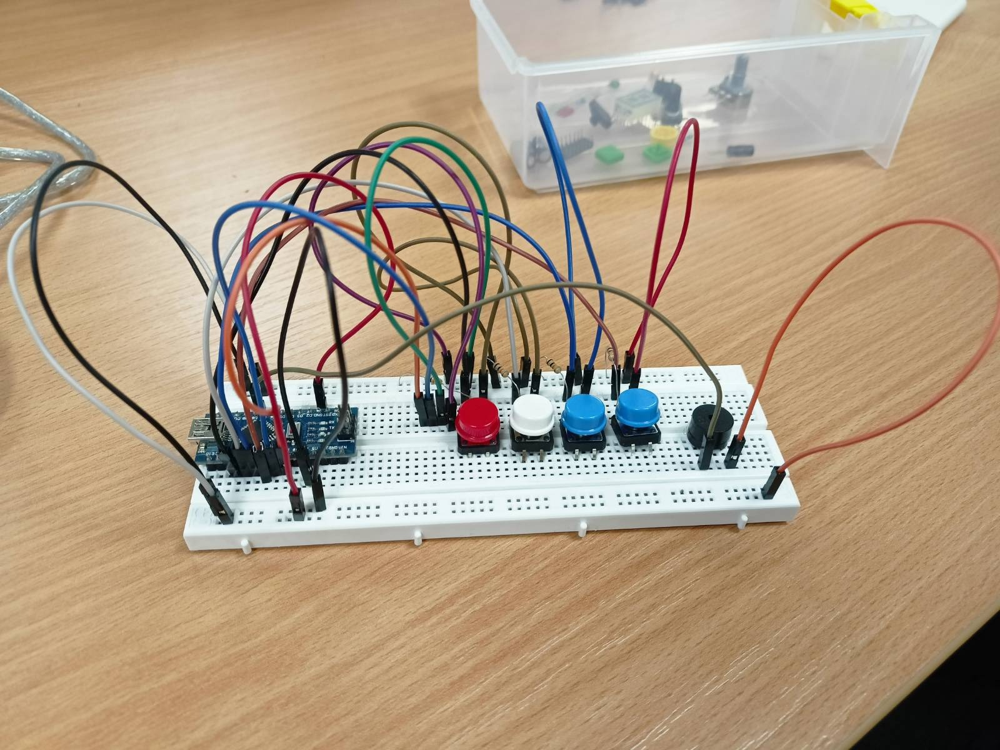
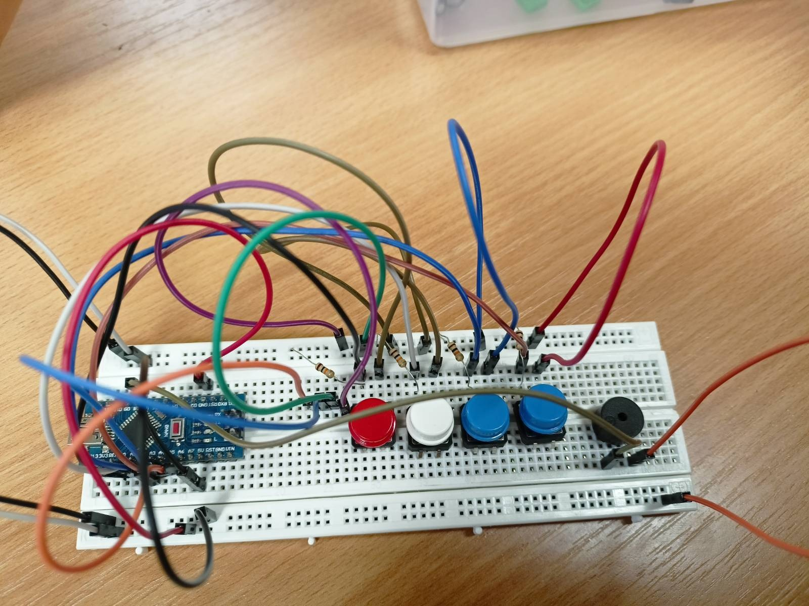

# Piano Nano

- **Cieľ**: ovládať aspoň 4 klávesy (C, D, E, F)
- **Komponenty**: 4x **funkčné** spínače, reproduktor, 4x rezistor (aspoň 100Ω)

# Schéma zapojenia


# Princíp fungovania
Piny, ktoré dostávajú vstup od tlačidla, dostávajú hodtotu HIGH (1). Po stlačení tlačidla sa však obvod uzemní a na pin prichádza hotnota LOW. Preto sledujeme hodnoty LOW a hráme požadovaný tón, kým je tlačidlo stlačené.
 ```
 while(digitalRead(C) == LOW)
  {
    tone(Buzz,T_C);
  }
  ```
  
  # Naše zapojenie
  (Je tam pár káblov navyše z predchádzajúceho projektu)
  
   
  

