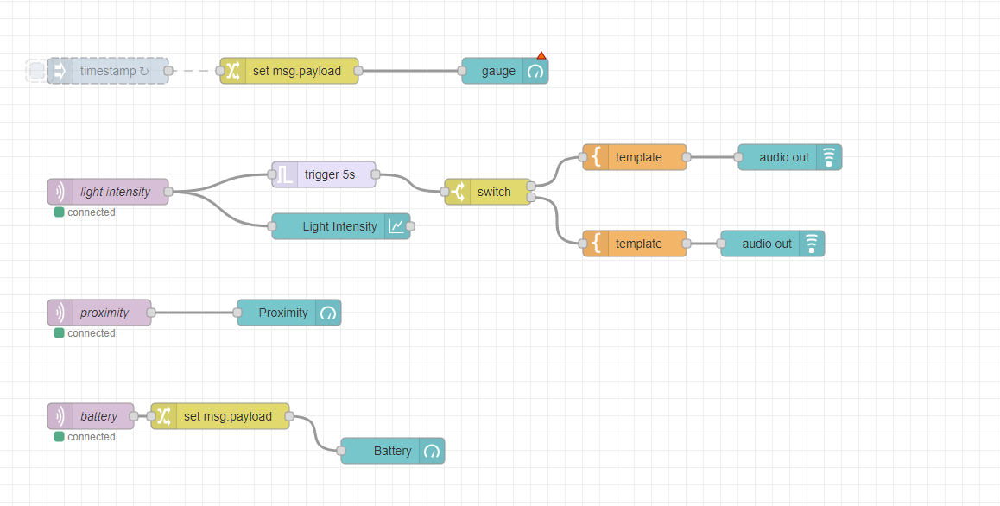
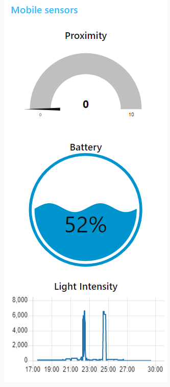

# Node Red Dashboard

- **Cieľ**: zobrazovať dáta z mobilných senzorov, ktoré sú posielané cez MQTT

# Schéma zapojenia

# Princíp fungovania
Čítame vstupné dáta z troch kanálov a zobrazujeme ich na dashboarde. 
Pri intenzite svetla dáta filtrujeme a hlásime, či je intenzita svetla vyskoá alebo nízka.
 
  
  # Výsledný dashboard
  

